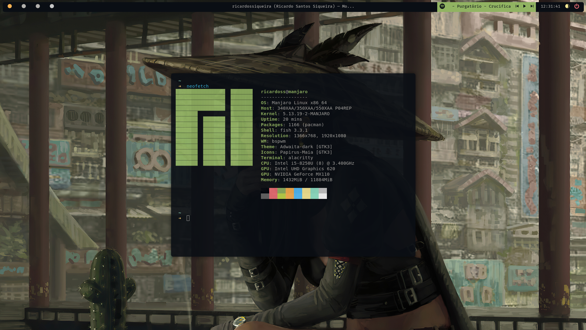

# BSPWM env config

|Neofetch|Main|
|:-:|:-:|
|||

## Theme

  [**Ayu Mirage**](https://github.com/dempfi/ayu)

## Dependencies

 - [zscroll-git](https://github.com/noctuid/zscroll)

## Includes 
 
 - allacrity
 - bspwm
 - conky 
 - fish 
 - [ibhagwan/picom](https://github.com/ibhagwan/picom)
 - polybar
 - pulse
 - rofi
 - starship
 - sxhkd
 - wallpapers
 - zsh